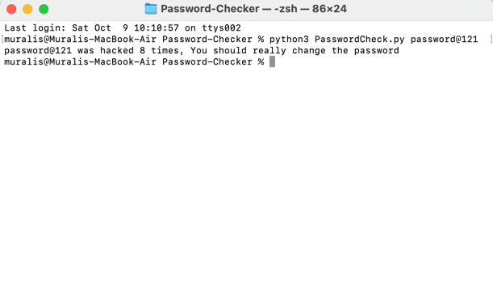

# Password-Checker
This source code will check if your password has ever been compromised. 


To run the code from your Terminal / Command prompt, navigate to the location of the file stored in your local drive then run the below command.

muralis@Muralis-MacBook-Air PasswordChecker % < python or python3 > < filename > < list of passwords seperated by space > 

```muralis@Muralis-MacBook-Air PasswordChecker % python3 PasswordCheck.py Password@121 test@121 ```

# **Output:**


